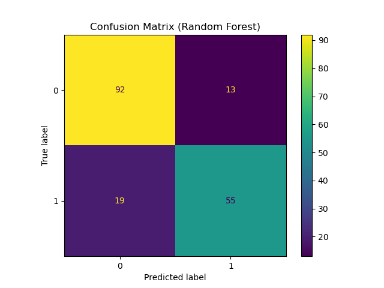
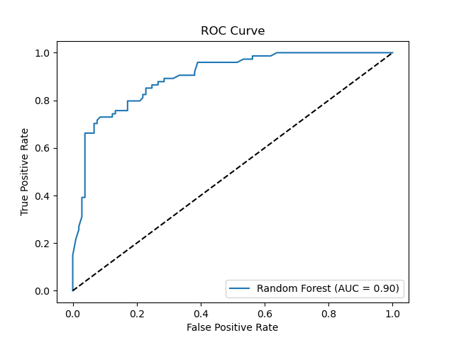
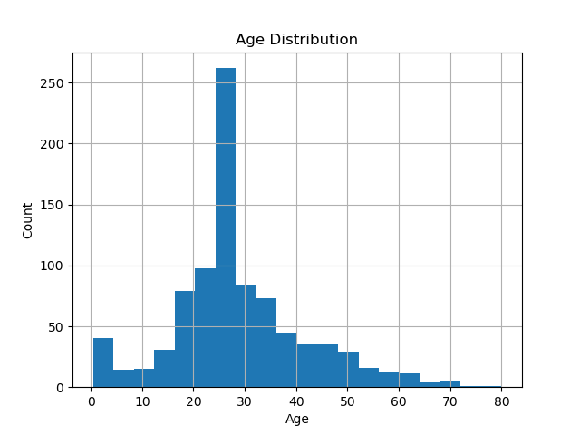
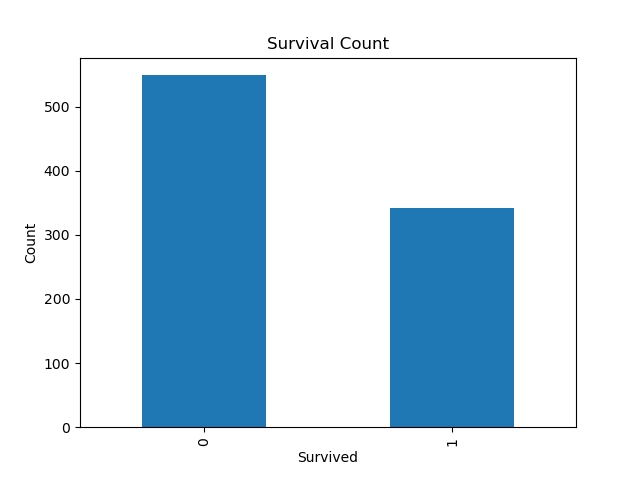

# Titanic Survivor Prediction

[](https://deepwiki.com/hardikkkraut/titanic-survivor-prediction)

This project provides an end-to-end machine learning solution for predicting passenger survival on the RMS Titanic, based on the classic Kaggle dataset. It includes a complete data analysis pipeline in a Jupyter Notebook, a trained Random Forest model, and an interactive web application built with Streamlit to predict survival based on user-input passenger data.

## Features

- **Interactive Web App**: A user-friendly Streamlit application (`app.py`) to get instant survival predictions.
- **Complete ML Pipeline**: The `titanic_survival.ipynb` notebook covers data loading, cleaning, preprocessing, feature engineering, and model training.
- **Pre-trained Model**: Includes a `model.pkl` file containing a pre-trained `RandomForestClassifier` for immediate use.
- **Data Visualization**: Generates and saves key visualizations like a confusion matrix, ROC curve, and feature distributions to the `visualizations/` directory.
- **Kaggle Submission Generation**: The notebook creates standard (`submission.csv`) and creative (`submission_fun.csv`) prediction files for the test dataset.

## Visualizations

The analysis notebook generates the following visualizations to evaluate model performance and understand the dataset.

| Confusion Matrix                                     | ROC Curve                                  |
| ---------------------------------------------------- | ------------------------------------------ |
|  |  |

| Age Distribution                                 | Survival Count                                 |
| ------------------------------------------------ | ---------------------------------------------- |
|  |  |

## Technology Stack

- **Python**
- **Streamlit**: For the interactive web application.
- **Scikit-learn**: For machine learning model training and evaluation.
- **Pandas**: For data manipulation and analysis.
- **Matplotlib**: For generating visualizations.
- **Jupyter Notebook**: For data exploration and model development.
- **Joblib**: For saving and loading the trained model.

## Repository Structure

```
.
├── app.py                  # Streamlit web application
├── model.pkl               # Pre-trained Random Forest model
├── README.md               # This README file
├── submission.csv          # Standard Kaggle submission file
├── submission_fun.csv      # Creative submission file with messages
├── test.csv                # Test dataset from Kaggle
├── titanic_survival.ipynb  # Jupyter Notebook with the full analysis
├── train.csv               # Training dataset from Kaggle
└── visualizations/         # Directory for saved plots
    ├── age_distribution.png
    ├── confusion_matrix.png
    ├── roc_curve.png
    └── survival_count.png
```

## Getting Started

### Prerequisites

- Python 3.8+
- `pip` package manager

### Installation

1.  **Clone the repository:**
    ```bash
    git clone https://github.com/hardikkkraut/titanic-survivor-prediction.git
    cd titanic-survivor-prediction
    ```

2.  **Install the required libraries:**
    ```bash
    pip install streamlit pandas scikit-learn matplotlib joblib Pillow
    ```
    *Note: The `app.py` file references an `image.png` that is not included in the repository. To run the app without errors, you may need to add an image with this name to the root directory or comment out the image-loading lines in `app.py`.*

## Usage

There are two main ways to use this repository: the interactive web app or the Jupyter Notebook.

### 1. Run the Interactive Web App

To start the Streamlit application and make interactive predictions:

```bash
streamlit run app.py
```

Your web browser will open a new tab with the application, where you can input passenger details and see the model's survival prediction.

### 2. Run the Jupyter Notebook

The notebook contains the complete workflow for this project. You can run it to understand the data processing steps, model training, and evaluation.

1.  **Start Jupyter Notebook:**
    ```bash
    jupyter notebook
    ```

2.  **Open and run the notebook:**
    In the Jupyter interface, open `titanic_survival.ipynb` and run the cells sequentially to reproduce the analysis and generate the submission files.